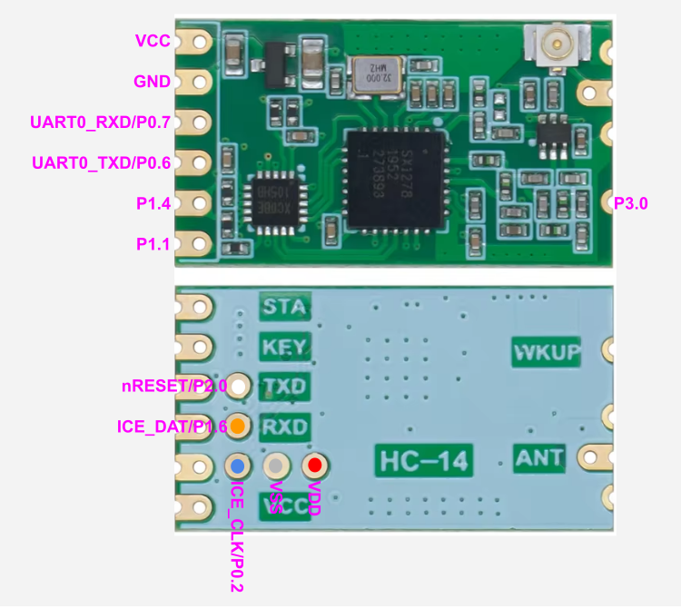

Retino
===
The poor man's radiosonde receiver

What is it
---
An alternative firmware for the HC-14 LoRa modules for receiving and decoding meteorological radiosondes. To be used in conjunction with a USB TTL serial adapter.

Currently able to receive the following radiosondes:
- Vaisala RS41[^1]
- Meteomodem M10
- Meteomodem M20
- Graw DFM09

The HC14Prog directory contains a sketch that enables an Arduino Nano (or similar board) to reprogram the HC-14 module. you need to connect 3 test points and power/ground to the Arduino as follows:

|Arduino|HC-14|
|---|---|
|5V|VCC|
|GND|GND|
|D2|nRESET|
|D3|ICE_CLK|
|D4|ICE_DAT|

This is only for the first time programming since you will be able to upgrade via a bootloader and the standard NuvoISP utility.

---
&#x26A0; **Needless to say the original firmware will be lost forever, you will not be able to use your HC-14 module as before**
---

[^1]: Receive only, no decoding. Raw packet transmitted to host

How to connect to the USB TTL serial adapter
---
|HC-14|adapter|
|---|---|
|VCC|+5V|
|GND|GND|
|TX|RX|
|RX|TX|

Input "protocol"
---
Line oriented
- ? request settings
- ttttttffffff 6 characters that represent the sonde type, case insensitive (rs41,m10,m20,dfm09), right padded with blanks, followed by 6 charactes indicating the requested frequency in kHz
- @ reboot in bootloader mode (for firmware updates)

Output "protocol"
---
Line oriented, first character specifies record type:
- D: decoded data. Followed by key:value pairs separated by commas
- P: raw packet. Followed by data in hex. Data is already "massaged" (manchester decoded and dewhitened)
- #: current settings. Followed by sonde type and  frequency in kHz separated by '@'

Reverse engineering of the HC-14 module
---
- Processor: Nuvoton MS51XC0BE
- Radio module: Semtech SX1278
- [PG2179TB](https://www.mouser.com/datasheet/2/286/nec_cel_upg2179tb-1186632.pdf) RF switch

Other connections:
|Function|Pin|
|---|---|
|SX1278 DIO0|P0.4|
|SX1278 DIO1|P0.3|
|SX1278 NRESET|P0.5|
|SX1278 MISO|P0.1/SPI0_MISO|
|SX1278 MOSI|P0.0/SPI0_MOSI|
|SX1278 SCK|P1.0/SPI0_CLK|
|SX1278 NSS|P1.2|
|SX1278 RXTX/RFMOD|P1.3|
|PG2179TB vcont2|P1.7|
|PG2179TB vcont1|P1.5|

Userful links
---
- [MS51_BSP](https://github.com/OpenNuvoton/MS51_BSP)
- [HC-14 – the simple LoRa module](https://wolles-elektronikkiste.de/en/hc-14-the-simple-lora-module)
- [Nuvoton8051ProgrammingLib](https://github.com/misaz/Nuvoton8051ProgrammingLib)
